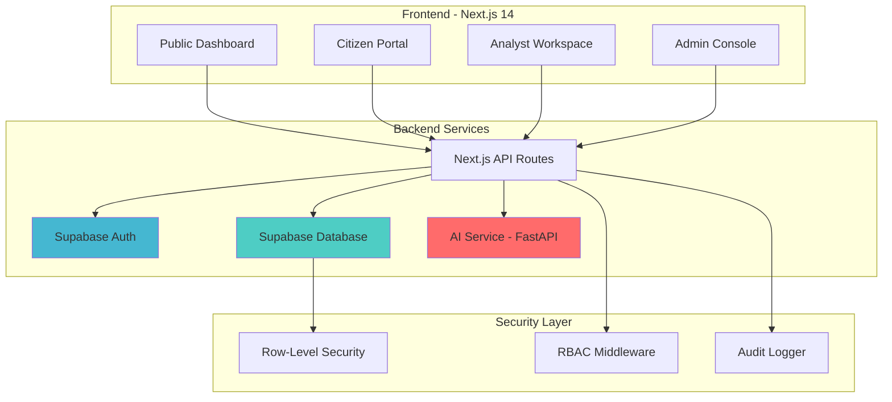

# 🏛️ Ministry of Finance Platform

> **Production-grade government financial transparency and management platform with AI-assisted analytics**

A comprehensive digital platform designed for government finance ministries to manage public finances, citizen welfare schemes, and provide transparent financial reporting. Built with enterprise-grade security, full auditability, and human-in-the-loop AI governance.

[](https://nextjs.org/)
[](https://www.typescriptlang.org/)
[](https://supabase.com/)
[](https://fastapi.tiangolo.com/)

---

## 📋 Table of Contents

- [Overview](#-overview)
- [Key Features](#-key-features)
- [Architecture](#-architecture)
- [Tech Stack](#-tech-stack)
- [Getting Started](#-getting-started)
- [Project Structure](#-project-structure)
- [User Roles & Access](#-user-roles--access)
- [AI Governance](#-ai-governance)
- [Security](#-security)
- [Database Schema](#-database-schema)
- [API Documentation](#-api-documentation)
- [Deployment](#-deployment)
- [Contributing](#-contributing)

---

## 🎯 Overview

The **Ministry of Finance Platform** is a full-stack application designed to modernize government financial operations while maintaining strict accountability and transparency standards. It serves four distinct user groups:

1. **Public Citizens** - View transparent financial data and access welfare schemes
2. **Registered Citizens** - Apply for government schemes and track applications
3. **Analysts** - Review applications, analyze trends with AI assistance
4. **Administrators** - Manage users, schemes, and monitor system health

### Core Principles

- ✅ **Human Decision-Making** - AI provides insights only; humans make all final decisions
- ✅ **Full Auditability** - Every action is logged with user attribution and timestamps
- ✅ **Transparency First** - Public financial data is accessible without authentication
- ✅ **Enterprise Security** - Row-Level Security (RLS), RBAC, and encrypted data
- ✅ **Graceful Degradation** - Core functions work even if AI service is unavailable

---

## ✨ Key Features

### 🌐 Public Dashboard
- Real-time financial metrics (revenue, expenditure, budget utilization)
- Interactive trend charts and KPI cards
- No authentication required - full transparency

### 👤 Citizen Portal
- Browse available government schemes
- Check eligibility using rule-based engine
- Submit and track benefit applications
- View application status and history

### 📊 Analyst Workspace
- Review citizen applications with detailed context
- AI-assisted trend analysis and forecasting
- Anomaly detection for financial data
- Human-in-the-loop approval workflow
- Audit trail for all decisions

### 🔧 Admin Console
- User management with role assignment
- Scheme creation and lifecycle management
- System health monitoring
- Comprehensive audit log viewer
- Citizen insights and analytics

### 🤖 AI Analysis Service
- **Trend Analysis** - Linear regression-based pattern detection
- **Forecasting** - Predictive modeling with confidence intervals
- **Anomaly Detection** - Z-score based outlier identification
- **Advisory Only** - All AI outputs require human review

---

## 🏗️ Architecture



### Data Flow

1. **Authentication**: Supabase handles user authentication with JWT tokens
2. **Authorization**: RBAC middleware validates user roles before data access
3. **Data Access**: Row-Level Security (RLS) policies enforce database-level permissions
4. **AI Integration**: Analysts request AI insights; system calls FastAPI service
5. **Audit Trail**: All mutations logged to `audit_logs` table with user context

---

## 🛠️ Tech Stack

### Frontend
- **Framework**: Next.js 14 (App Router)
- **Language**: TypeScript 5
- **Styling**: TailwindCSS 3.4
- **UI Components**: shadcn/ui (Radix UI primitives)
- **Charts**: Recharts 2.13
- **Animations**: Framer Motion 11
- **State Management**: React Server Components + Server Actions

### Backend
- **Database**: Supabase (PostgreSQL)
- **Authentication**: Supabase Auth
- **AI Service**: Python FastAPI
- **API**: Next.js API Routes + Server Actions

### AI/ML
- **Framework**: FastAPI
- **Libraries**: NumPy, SciPy
- **Algorithms**: Linear Regression, Z-Score Anomaly Detection

### DevOps
- **Containerization**: Docker (AI Service)
- **Version Control**: Git
- **Package Manager**: npm

---

## 🚀 Getting Started

### Prerequisites

- **Node.js** 18+ and npm
- **Python** 3.9+ (for AI service)
- **Supabase Account** (free tier works)
- **Git**


### 3. Set Up Database

Run the SQL scripts in your Supabase SQL Editor in this order:

```bash
# 1. Create schema and tables
supabase/schema.sql

# 2. Set up authentication triggers
supabase/setup_auth_trigger.sql

# 3. Seed initial data (optional)
supabase/seed.sql
supabase/seed_schemes.sql
```

### 4. Install Frontend Dependencies

```bash
npm install
```

### 5. Set Up AI Service

```bash
cd ai-service
pip install -r requirements.txt
```

### 6. Run the Application

**Terminal 1 - Frontend:**
```bash
npm run dev
```

**Terminal 2 - AI Service:**
```bash
cd ai-service
python main.py
```

### 7. Access the Application

- **Frontend**: http://localhost:3000
- **AI Service**: http://localhost:8000
- **API Docs**: http://localhost:8000/docs

### 8. Create Admin User

1. Sign up at http://localhost:3000/staff-login
2. Run this SQL in Supabase to promote your user:

```sql
-- Replace with your user's email
UPDATE public.profiles 
SET role = 'admin' 
WHERE email = 'your-email@example.com';
```

---


## 👥 User Roles & Access

| Role | Access Level | Capabilities |
|------|-------------|--------------|
| **Public** | Read-only | View public financial dashboard |
| **Citizen** | Authenticated | Browse schemes, apply for benefits, track applications |
| **Analyst** | Staff | Review applications, access AI insights, approve/reject requests |
| **Admin** | Full Access | User management, scheme management, system monitoring |

#

## 🤖 AI Governance

### Human-in-the-Loop (HITL) Framework

> **Core Principle**: AI is **advisory only** - humans make all final decisions.

#### AI Capabilities & Limitations

| Feature | AI Role | Human Role |
|---------|---------|------------|
| **Trend Analysis** | Detect patterns, calculate slopes | Verify data accuracy, understand context |
| **Forecasting** | Project future values | Validate assumptions, approve forecasts |
| **Anomaly Detection** | Flag statistical outliers | Investigate root cause, dismiss false positives |
| **Citizen Eligibility** | **NONE** (Rule-based only) | Define rules, maintain criteria |

#### Governance Rules

1. ✅ **No Automated Decisions** - AI cannot approve budgets, publish reports, or deny applications
2. ✅ **Advisory Labels** - All AI outputs labeled as "AI-Generated Insight"
3. ✅ **Mandatory Review** - Analysts must explicitly approve AI insights
4. ✅ **Explainability** - AI provides natural language explanations for all outputs
5. ✅ **Graceful Degradation** - Platform works without AI service

#### Algorithm Transparency

- **Trend Detection**: Standard linear regression (scipy.stats.linregress)
- **Forecasting**: Linear extrapolation with confidence intervals
- **Anomaly Detection**: Z-score method (threshold: 3.0σ)

See [AI-GOVERNANCE.md](./AI-GOVERNANCE.md) for full policy.

---

## 🔒 Security

### Authentication
- **Provider**: Supabase Auth
- **Method**: JWT tokens with secure HTTP-only cookies
- **Session Management**: Automatic token refresh

### Authorization
- **Row-Level Security (RLS)**: Database-level access control
- **RBAC Middleware**: Route-level role validation
- **API Protection**: All mutations require authentication

### Data Protection
- **Encryption**: Data encrypted at rest and in transit
- **Secrets Management**: Environment variables for sensitive data
- **Input Validation**: Zod schemas for all user inputs

### Audit Trail
Every mutation is logged with:
- User ID and role
- Action performed
- Timestamp
- IP address (optional)
- Before/after state (for updates)

```typescript
// Example audit log entry
{
  user_id: "uuid",
  action: "application_approved",
  entity_type: "application",
  entity_id: "app-123",
  metadata: { application_id: "app-123", scheme_id: "scheme-456" },
  timestamp: "2026-02-04T06:00:00Z"
}
```

See [SECURITY.md](./SECURITY.md) for detailed security practices.

---


## 📡 API Documentation

### Frontend API Routes

#### Schemes API
```typescript
GET    /api/schemes              // List all active schemes
POST   /api/schemes              // Create scheme (admin only)
GET    /api/schemes/[id]         // Get scheme details
PATCH  /api/schemes/[id]/status  // Update scheme status (admin only)
```

#### Applications API
```typescript
GET    /api/applications         // List applications (filtered by role)
POST   /api/applications         // Submit application (citizen)
POST   /api/applications/[id]/review  // Review application (analyst)
```

### AI Service API

Base URL: `http://localhost:8000`

#### Trend Analysis
```http
POST /analyze/trends
Content-Type: application/json

{
  "metric_name": "Monthly Revenue",
  "data": [100, 120, 115, 130, 145],
  "timestamps": ["2024-01", "2024-02", "2024-03", "2024-04", "2024-05"]
}
```

**Response:**
```json
{
  "metric_name": "Monthly Revenue",
  "trend_direction": "upward",
  "slope": 11.5,
  "confidence": 92.3,
  "data_points_analyzed": 5,
  "explanation": "The Monthly Revenue demonstrates an upward trend..."
}
```

#### Forecasting
```http
POST /analyze/forecast
Content-Type: application/json

{
  "metric_name": "Budget Utilization",
  "data": [85, 88, 90, 87, 92],
  "forecast_periods": 3
}
```

#### Anomaly Detection
```http
POST /analyze/anomalies
Content-Type: application/json

{
  "metric_name": "Daily Expenditure",
  "data": [100, 105, 102, 500, 98],
  "threshold": 3.0
}
```

**Interactive Docs**: http://localhost:8000/docs

---

## 🚢 Deployment

### Frontend (Next.js)

**Vercel (Recommended)**
```bash
# Install Vercel CLI
npm i -g vercel

# Deploy
vercel --prod
```

**Environment Variables:**
Set in Vercel dashboard:
- `NEXT_PUBLIC_SUPABASE_URL`
- `NEXT_PUBLIC_SUPABASE_ANON_KEY`
- `SUPABASE_SERVICE_ROLE_KEY`
- `NEXT_PUBLIC_AI_SERVICE_URL`

### AI Service (FastAPI)

**Docker Deployment**
```bash
cd ai-service
docker build -t mof-ai-service .
docker run -p 8000:8000 mof-ai-service
```

**Render/Railway**
1. Connect GitHub repository
2. Set build command: `pip install -r requirements.txt`
3. Set start command: `uvicorn main:app --host 0.0.0.0 --port $PORT`

### Database (Supabase)

Already hosted - no deployment needed. For production:
1. Upgrade to Supabase Pro for better performance
2. Enable Point-in-Time Recovery (PITR)
3. Set up database backups

---

## 🤝 Contributing

We welcome contributions! Please follow these guidelines:

### Development Workflow

1. **Fork the repository**
2. **Create a feature branch**
   ```bash
   git checkout -b feature/your-feature-name
   ```
3. **Make your changes**
4. **Test thoroughly**
   ```bash
   npm run build  # Ensure no build errors
   ```
5. **Commit with descriptive messages**
   ```bash
   git commit -m "feat: add scheme approval workflow"
   ```
6. **Push and create Pull Request**

### Code Standards

- **TypeScript**: Strict mode enabled
- **Formatting**: Prettier (run `npm run format`)
- **Linting**: ESLint (run `npm run lint`)
- **Commits**: Conventional Commits format

### Testing Checklist

- [ ] All user roles tested (citizen, analyst, admin)
- [ ] RLS policies verified
- [ ] AI service integration tested
- [ ] Audit logs generated correctly
- [ ] No console errors
- [ ] Mobile responsive

---

## 📄 License

This project is licensed under the **MIT License** - see the [LICENSE](LICENSE) file for details.

---

## 📞 Support

- **Issues**: [GitHub Issues](https://github.com/JesseSathyadas/ministry-of-finance-platform/issues)
- **Documentation**: See `/docs` folder
- **Email**: support@example.gov (replace with actual contact)

---

## 🙏 Acknowledgments

- **shadcn/ui** for beautiful UI components
- **Supabase** for backend infrastructure
- **Vercel** for Next.js framework
- **FastAPI** for AI service framework

---


<div align="center">

**Built with ❤️ for transparent governance**

[⬆ Back to Top](#-ministry-of-finance-platform)

</div>
